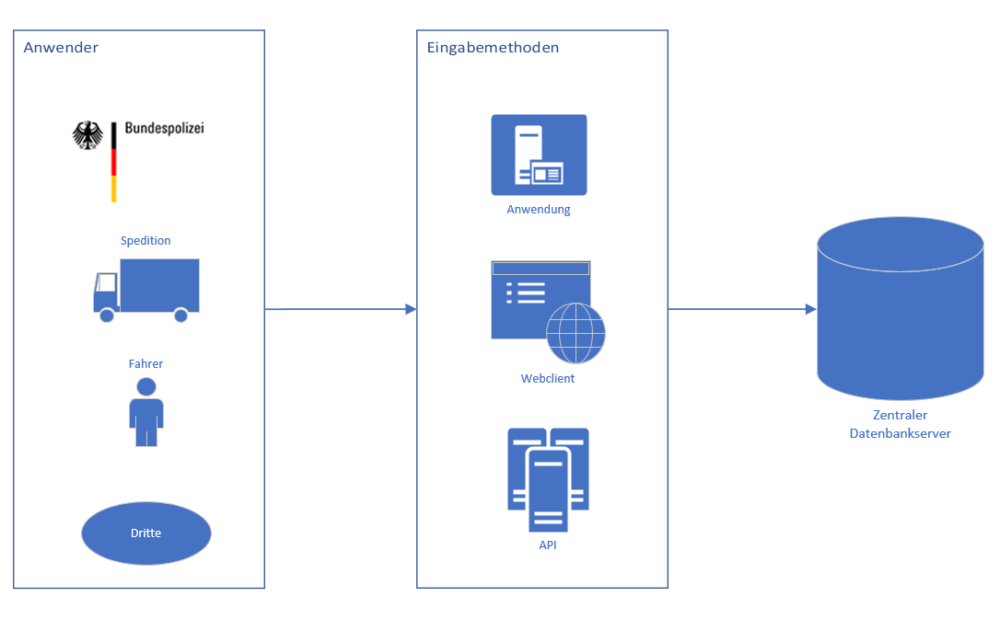
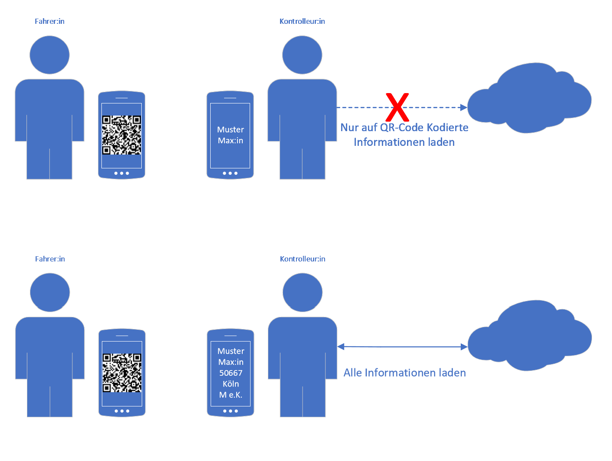

# e-BorderControl:in 
Bei Hackathon WirVsVirus entstandenes Repo bzgl. Speicherung und Bearbeitung von Formularen zur Einreise

e-BorderControl:in  ist ein Proof of Concept für schnellere Abwicklung von Grenzkontrollen welche durch das Corona Virus entstehen.

Proof of Concept ist [HIER](https://wirvsvirus-hack.herokuapp.com/) erreichbar.

Devpost Link: [HIER](https://devpost.com/software/01_036_grenzkontrollen_e-bordercontrol-in)

# Weitere Informationen
[Ab 1:44](https://www.youtube.com/watch?v=JG4D3ZPHFU0?t=104) sieht man eine Grenz"kontrolle"

# Technische Dokumentation

Bei der Entwicklung von e-BorderControl:in haben wir uns darauf konzentriert ein Proof of Concept zu entwickeln welcher die Idee
hinter automatisierten Grenzkontrollen aufzeigt.

Um die Anforderungen für Hacker:in möglichst gering zu halten, besteht das Projekt ausschließlich aus clientseitigen Technologien (HTML / CSS / JS).
Es ist möglich das Projekt einfach auszuchecken und direkt die Dateien zu öffnen (bewusst kein npm / webpack / ...). 

Sollte man das Projekt weiter verfolgen wird zwingend ein Backend mit Anmeldung benötigt. Auf Seiten der Bundespolizei wäre dies sehr gut über SSO möglich.
Wir haben verschiedene Rollen durch eine unterschiedliche Farbwahl gekennzeichnet.
So ist die Oberfläche für Personal zur Grenzkontrolle in Grün gehalten, für normale Nutzer in einem dunklen Grau. Bei dem Personal soll es unterschiedliche, konfigurierbare Berechtigungsstufen geben. 

Ein QR-Code wird für die Kombination aus Fahrer und Fahrzeug erzeugt.
Der Fahrer hat jederzeit die Möglichkeit einen entsprechenden QR-Code zu generieren.
Kopieren (beispielsweise durch abfotografieren) des QR-Codes wird dadurch verhindert, dass diese nur einmalig und kurzzeitig gültig sind.  
In Verdachtsfällen kann der Ordnungshüter den im hinterlegten QR-Code hinterlegten Vor- und Zunamen mit dem Personalausweis, das Nummernschild mit dem QR-Code und selbstverständlich die üblichen Frachtpapiere abgleichen.

## Offline / Online

Sollte man das Projekt weiter verfolgen, würde das Projekt ab der nächsten Ausbaustufe für die Generierung der QR-Codes eine Internetverbindung benötigen.
Das validieren der QR-Codes könnte dahingehend offline stattfinden. QR-Codes könnten digital signiert und so schnell geprüft werden.

## Anreichern von Daten

Grundsätzlich könnten beliebige Parteien Daten hinterlegen. 
Es wäre auch möglich, dass der Fahrer schon vor der Ein-/Ausreise beispielsweise an einer
Raststätte bei einer autorisierten Instanz ein Gesundheitszeugnis (z. B. Fiebermessen) erhält. Diese Daten könnten mit dem QR-Code verknüpft werden.
Je nach Autorisierung könnten unterschiedliche Daten hinterlegt werden. Grundsätzlich wäre es auch denkbar Dritten zu ermöglichen Daten zu hinterlegen.
Beispielsweise könnten andere Staaten verschlüsselt ohne jegliche weitere Beschränkung Daten hinterlegen welche nur von ihnen oder von autorisierten Personen abgegriffen werden können.
Durch digitale Signierprozesse wäre es sogar möglich, Teilinformationen offline auf dem Endgerät des Nutzers (Fahrers) zu hinterlegen. 

## Auslesen der Daten

Grundsätzlich könnten autorisierte Instanzen wie Behörden die Daten hinter dem QR-Code auslesen.
Dritte können ihre hinterlegten Daten mit einem privaten Token abgreifen und entschlüsseln.
Es wäre denkbar ausländischen Behörden Teilzugriffe auf die Daten zu geben.
Grundsätzlich könnte man aber jedem (völlig ohne Registrierung) die Frage beantworten, ob ein gewisser QR-Code laut deutschem Stand passieren darf oder nicht.
So könnten beispielsweise polnische Behörden, ohne jegliche Registrierung ihren Grenzschützern ermöglichen, Daten zu denen Entschlüsselungscodes vorliegen, abzufragen.

